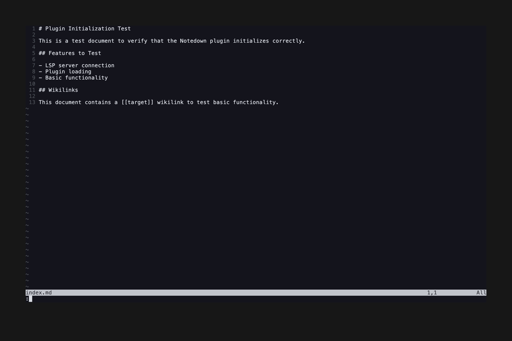

# Workspace Status Command



The `:NotedownWorkspaceStatus` command provides comprehensive information about the current workspace detection and LSP server status.

## Description

This feature allows users to quickly understand:
- Whether a Notedown workspace has been detected
- Current LSP server connection status  
- Workspace root directory location
- Any configuration issues or errors

## Usage

Run the command in any buffer:
```vim
:NotedownWorkspaceStatus
```

The command will display a status message showing:
- **Workspace detected**: Whether the current directory is recognized as a Notedown workspace
- **LSP status**: Connection status with the notedown-language-server
- **Root directory**: The workspace root that was detected
- **Configuration**: Any relevant configuration information

## Example Output

```
Notedown Workspace Status:
  Workspace: Detected (/path/to/workspace)
  LSP Server: Connected (notedown-language-server v1.0.0)
  Root: /path/to/workspace
  Files: 15 markdown files indexed
```

## Technical Details

### Implementation
- Defined as a Neovim user command in the plugin initialization
- Uses LSP client queries to gather server information
- Accesses workspace detection logic from the configuration module

### Command Registration
```lua
vim.api.nvim_create_user_command('NotedownWorkspaceStatus', function()
    -- Implementation queries LSP client and workspace detection
end, { desc = 'Show Notedown workspace and LSP status' })
```

### Error Handling
- Gracefully handles cases where LSP server is not connected
- Provides helpful error messages for troubleshooting
- Shows configuration suggestions when workspace detection fails

## Use Cases

### Development and Debugging
- Verify plugin loaded correctly after installation
- Troubleshoot LSP connection issues
- Confirm workspace detection is working as expected

### User Onboarding  
- Help new users understand plugin status
- Provide clear feedback about setup requirements
- Guide users to resolve configuration issues

### CI/CD and Testing
- Automated verification that plugin initializes correctly
- Integration test validation of workspace detection
- LSP server connection verification in test environments

## Related Features

- [Plugin Loading](../plugin-loading/) - Initial plugin setup
- [LSP Connection](../lsp-connection/) - Server communication setup
- Workspace detection (configuration module)

## Test Implementation

This feature is tested using VHS to simulate real terminal interactions:

1. Open Neovim in a test workspace
2. Wait for plugin initialization  
3. Execute `:NotedownWorkspaceStatus`
4. Verify expected output is displayed
5. Capture both ASCII output for regression testing and GIF for documentation

The test validates both successful status display and proper error handling when components are unavailable.