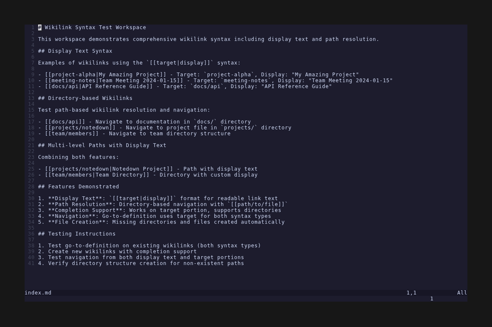

# Wikilinks

Notedown's wikilink system provides powerful internal linking capabilities with intelligent completion, navigation, and file management.

## Features

- **Smart Completion**: Intelligent suggestions based on existing files, referenced targets, and directory paths
- **Go-to-Definition**: Navigate to wikilink targets or create new files automatically
- **Display Text**: Support for `[[target|display]]` syntax to customize link appearance with concealment
- **Path Resolution**: Handle both simple names and directory-based structures
- **Disambiguation**: Detect ambiguous wikilinks and resolve them through code actions
- **Diagnostics**: Real-time detection of broken wikilinks
- **Automatic File Creation**: Generate markdown files for missing wikilink targets
- **Visual Concealment**: Hide target portions of display text wikilinks for cleaner appearance

## Wikilink Syntax

### Basic Wikilinks
```markdown
[[target]]
```

### Display Text
```markdown
[[target|Custom Display Text]]
```

### Path-based Links
```markdown
[[docs/api]]
[[projects/notedown]]
```

## Test Coverage

| Feature | Description | Demo |
|---------|-------------|------|
| [Completion](./completion/) | Intelligent wikilink completion suggestions |  |
| [Syntax](./syntax/) | Comprehensive wikilink syntax including display text, path resolution, navigation, and concealment |  |
| [Diagnostics and Code Actions](./diagnostics-and-code-actions/) | Real-time feedback on wikilink validity and automated fixes |  |

## How It Works

The wikilink system uses a sophisticated indexing mechanism that:

1. **Tracks All Targets**: Maintains a registry of wikilink targets across the workspace
2. **Monitors File Existence**: Checks whether targets correspond to actual files
3. **Detects Conflicts**: Identifies when targets match multiple files
4. **Provides Completions**: Offers intelligent suggestions during typing
5. **Enables Navigation**: Allows seamless navigation between linked documents
6. **Creates Files**: Automatically generates missing target files when needed

## Workspace Integration

Wikilinks work seamlessly with Notedown workspaces by:
- Scanning all markdown files for wikilink references
- Indexing targets with reference counting
- Providing real-time updates as files change
- Supporting both workspace-relative and absolute paths