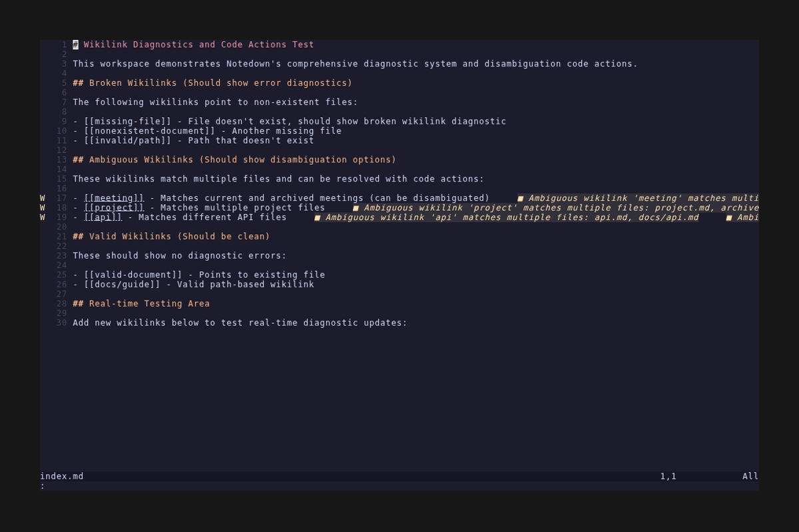

# Wikilink Diagnostics and Code Actions

This feature demonstrates Notedown's ability to detect ambiguous wikilinks and provide automated fixes through LSP code actions.

## What This Demonstrates

### Real-time Diagnostics
- **Ambiguous Wikilink Detection**: Identifies when a wikilink target matches multiple files
- **Live Feedback**: Shows diagnostic warnings as you type
- **Location List Integration**: View all diagnostics in Neovim's location list

### Automated Code Actions
- **Disambiguation Options**: Provides specific path choices to resolve ambiguous links
- **One-click Fixes**: Apply corrections directly through the editor
- **Context-aware Solutions**: Suggests the most relevant file paths based on workspace structure

## Demo Overview

The demonstration shows:

1. **Opening a file** with ambiguous wikilinks that could match multiple files
2. **Viewing diagnostics** that identify the ambiguous links
3. **Using location list** (`:lua vim.diagnostic.setloclist()`) to navigate to issues
4. **Applying code actions** to select specific target paths and resolve ambiguity
5. **Verification** that warnings disappear after applying fixes

## Key Features

### Intelligent Ambiguity Detection
- Scans workspace for files that match wikilink targets
- Identifies cases where `[[meeting]]` could refer to multiple files:
  - `meeting.md`
  - `archive/meeting.md` 
  - `meetings/meeting.md`

### Context-Aware Code Actions
- Provides specific path options to disambiguate links
- Maintains original display text when using `[[target|display]]` syntax
- Updates only the target portion while preserving formatting

### Seamless Integration
- Works with Neovim's built-in diagnostic system
- Integrates with location list for easy navigation
- Provides immediate visual feedback when issues are resolved

## Testing Workspace

The test workspace includes intentionally ambiguous files:
- `meeting.md` (root level)
- `archive/meeting.md` (in archive directory)
- `meetings/meeting.md` (in meetings directory)

This creates realistic scenarios where disambiguation is needed to maintain clear, unambiguous document linking.