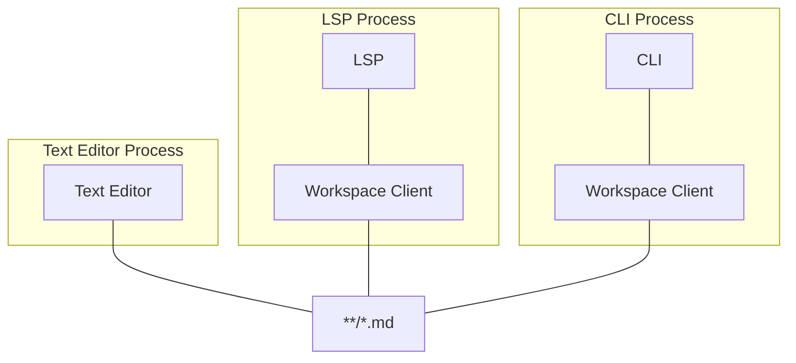
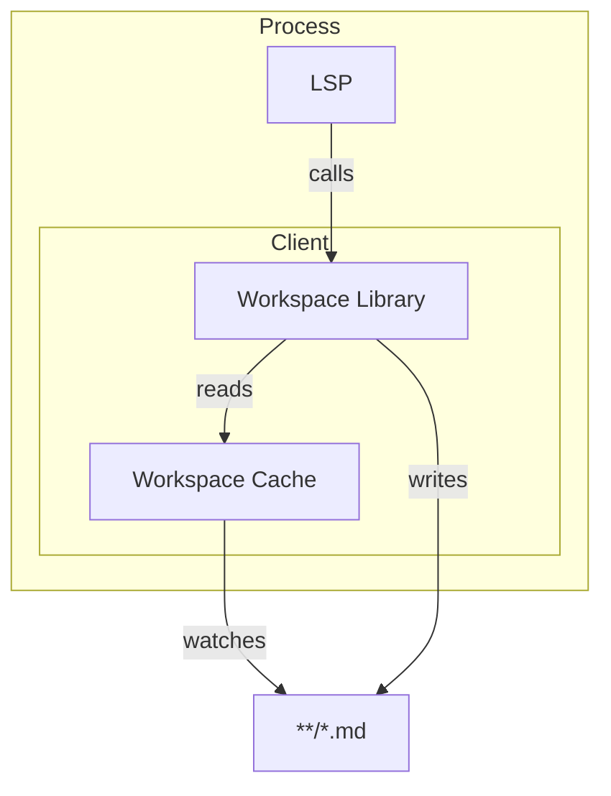

## Data Clients

Each workspace can potentially have many client interacting with it. These can be split into two categories, ones that interact with the markdown as unstructured data and those that interact with it as structured data.

Unstructured data clients effectively interact with the workspace at the level of plain text e.g. text editors (not LSPs though). Whereas, structured data clients use the workspace client to interact with high level objects like tasks and projects.

As unstructured data clients interact with the files on disk directly we don't need to build any additional features beyond what already exists in filesystems and the text editors themselves. However, in order to support structured data we obviously need to parse the unstructured data and present a different abstraction.

## Workspace Data Flow

The design of the workspace client chooses to trade off resource consumption (cpu and disk) for an easier to understand system. As such, each workspace client instance is responsible for their own cache and the only shared resource are the underlying markdown files and workspace settings. This approach results in more CPU and disk usage but avoids the need to coordinate between clients avoiding a whole section of computer science problems.

## Workspace Client Data Flow

The source of truth (**/*.md) can be modified by things outside of the process and even outside of client libraries we write. To account for this, we will use a unidirectional data flow approach inspired by React.

